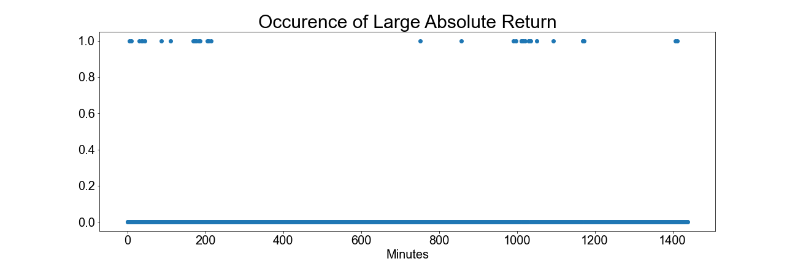

[](http://quantlet.de/)

## [](http://quantlet.de/) **HawkesProcesses** [](http://quantlet.de/)

```yaml


Name of Quantlet:  HawkesProcesses

Published in:     ''

Description:      'Estimate and forecast Hawkes Processes using maximum likelihood estimation. Multiple kernels for the intensity function are possible. Apply a Hawkes Process to BTCUSD 1-second data and predict futures price jumps. Up-to-date price data can be found here (https://data.binance.vision/?prefix=data/spot/daily/klines/BTCTUSD/1s/)'

Submitted:  '05 Oct 2023'

Keywords: 
- 'Hawkes Processes'
- 'Stochastic Jumps'
- 'Bitcoin Price Jumps'
- 'Stochastic Process'
- 'Self-Exciting Jumps'

Author: 
- 'Lukas Krain'

See also: 
- 'Lee Mykland Jump Test'
- 'Hawkes, Omitakahiro'
```





